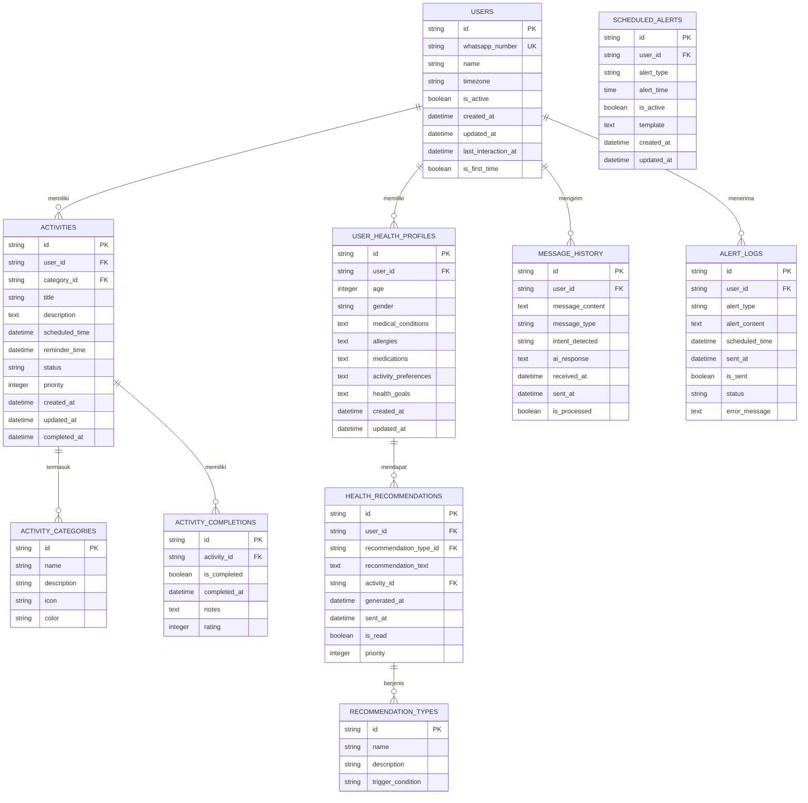

# Entity Relationship Diagram (ERD) Smart Alert System

## ERD Diagram

## Deskripsi Tabel

### 1. USERS
Tabel untuk menyimpan data pengguna sistem.

**Kolom:**
- `id`: Primary key, UUID
- `whatsapp_number`: Nomor WhatsApp user (unique)
- `name`: Nama user
- `timezone`: Timezone user (untuk scheduling)
- `is_active`: Status aktif user
- `created_at`: Waktu registrasi
- `updated_at`: Waktu update terakhir
- `last_interaction_at`: Waktu interaksi terakhir
- `is_first_time`: Flag untuk user baru (untuk welcome message)

### 2. ACTIVITIES
Tabel untuk menyimpan kegiatan yang dijadwalkan user.

**Kolom:**
- `id`: Primary key, UUID
- `user_id`: Foreign key ke USERS
- `category_id`: Foreign key ke ACTIVITY_CATEGORIES
- `title`: Judul kegiatan
- `description`: Deskripsi kegiatan
- `scheduled_time`: Waktu terjadwal kegiatan
- `reminder_time`: Waktu reminder (bisa berbeda dari scheduled_time)
- `status`: Status (pending, completed, cancelled, overdue)
- `priority`: Prioritas (1-5)
- `created_at`: Waktu dibuat
- `updated_at`: Waktu update terakhir
- `completed_at`: Waktu selesai (jika completed)

### 3. ACTIVITY_CATEGORIES
Tabel untuk kategori kegiatan (olahraga, makan, kerja, dll).

**Kolom:**
- `id`: Primary key, UUID
- `name`: Nama kategori
- `description`: Deskripsi kategori
- `icon`: Icon untuk kategori
- `color`: Warna untuk kategori

### 4. ACTIVITY_COMPLETIONS
Tabel untuk tracking penyelesaian kegiatan.

**Kolom:**
- `id`: Primary key, UUID
- `activity_id`: Foreign key ke ACTIVITIES
- `is_completed`: Status selesai
- `completed_at`: Waktu selesai
- `notes`: Catatan tambahan
- `rating`: Rating kegiatan (1-5)

### 5. USER_HEALTH_PROFILES
Tabel untuk profil kesehatan user.

**Kolom:**
- `id`: Primary key, UUID
- `user_id`: Foreign key ke USERS
- `age`: Umur user
- `gender`: Jenis kelamin
- `medical_conditions`: Kondisi medis (JSON)
- `allergies`: Alergi (JSON)
- `medications`: Obat-obatan (JSON)
- `activity_preferences`: Preferensi aktivitas (JSON)
- `health_goals`: Tujuan kesehatan (JSON)
- `created_at`: Waktu dibuat
- `updated_at`: Waktu update terakhir

### 6. HEALTH_RECOMMENDATIONS
Tabel untuk menyimpan rekomendasi kesehatan yang dihasilkan AI.

**Kolom:**
- `id`: Primary key, UUID
- `user_id`: Foreign key ke USERS
- `recommendation_type_id`: Foreign key ke RECOMMENDATION_TYPES
- `recommendation_text`: Teks rekomendasi
- `activity_id`: Foreign key ke ACTIVITIES (opsional, jika terkait kegiatan spesifik)
- `generated_at`: Waktu rekomendasi dibuat
- `sent_at`: Waktu rekomendasi dikirim
- `is_read`: Status sudah dibaca
- `priority`: Prioritas rekomendasi

### 7. RECOMMENDATION_TYPES
Tabel untuk tipe rekomendasi kesehatan.

**Kolom:**
- `id`: Primary key, UUID
- `name`: Nama tipe (exercise, nutrition, sleep, hydration, dll)
- `description`: Deskripsi tipe
- `trigger_condition`: Kondisi trigger rekomendasi

### 8. MESSAGE_HISTORY
Tabel untuk menyimpan history pesan WhatsApp.

**Kolom:**
- `id`: Primary key, UUID
- `user_id`: Foreign key ke USERS
- `message_content`: Isi pesan
- `message_type`: Tipe pesan (incoming, outgoing)
- `intent_detected`: Intent yang terdeteksi AI
- `ai_response`: Response dari AI
- `received_at`: Waktu diterima
- `sent_at`: Waktu dikirim
- `is_processed`: Status sudah diproses

### 9. ALERT_LOGS
Tabel untuk log alert yang dikirim ke user.

**Kolom:**
- `id`: Primary key, UUID
- `user_id`: Foreign key ke USERS
- `alert_type`: Tipe alert (morning_alert, evening_summary, activity_reminder)
- `alert_content`: Isi alert
- `scheduled_time`: Waktu terjadwal
- `sent_at`: Waktu dikirim
- `is_sent`: Status sudah dikirim
- `status`: Status (pending, sent, failed)
- `error_message`: Pesan error jika gagal

### 10. SCHEDULED_ALERTS
Tabel untuk konfigurasi alert terjadwal.

**Kolom:**
- `id`: Primary key, UUID
- `user_id`: Foreign key ke USERS
- `alert_type`: Tipe alert (morning, evening)
- `alert_time`: Waktu alert (05:00, 22:00)
- `is_active`: Status aktif
- `template`: Template pesan
- `created_at`: Waktu dibuat
- `updated_at`: Waktu update terakhir

## Relasi Antar Tabel

1. **USERS → ACTIVITIES**: One-to-Many
   - Satu user bisa memiliki banyak kegiatan

2. **USERS → USER_HEALTH_PROFILES**: One-to-One
   - Satu user memiliki satu profil kesehatan

3. **USERS → MESSAGE_HISTORY**: One-to-Many
   - Satu user bisa memiliki banyak history pesan

4. **USERS → ALERT_LOGS**: One-to-Many
   - Satu user bisa menerima banyak alert

5. **ACTIVITIES → ACTIVITY_CATEGORIES**: Many-to-One
   - Banyak kegiatan bisa dalam satu kategori

6. **ACTIVITIES → ACTIVITY_COMPLETIONS**: One-to-Many
   - Satu kegiatan bisa memiliki banyak completion record (untuk tracking)

7. **USER_HEALTH_PROFILES → HEALTH_RECOMMENDATIONS**: One-to-Many
   - Satu profil kesehatan bisa menghasilkan banyak rekomendasi

8. **HEALTH_RECOMMENDATIONS → RECOMMENDATION_TYPES**: Many-to-One
   - Banyak rekomendasi bisa dalam satu tipe

9. **HEALTH_RECOMMENDATIONS → ACTIVITIES**: Many-to-One (optional)
   - Rekomendasi bisa terkait dengan kegiatan spesifik

## Index yang Disarankan

1. `USERS.whatsapp_number` - UNIQUE INDEX (untuk lookup cepat)
2. `ACTIVITIES.user_id` - INDEX (untuk query kegiatan per user)
3. `ACTIVITIES.scheduled_time` - INDEX (untuk query berdasarkan waktu)
4. `ACTIVITIES.status` - INDEX (untuk filter status)
5. `MESSAGE_HISTORY.user_id` - INDEX (untuk query history per user)
6. `MESSAGE_HISTORY.received_at` - INDEX (untuk query berdasarkan waktu)
7. `ALERT_LOGS.user_id` - INDEX (untuk query alert per user)
8. `ALERT_LOGS.scheduled_time` - INDEX (untuk query berdasarkan waktu)
9. `HEALTH_RECOMMENDATIONS.user_id` - INDEX (untuk query rekomendasi per user)

