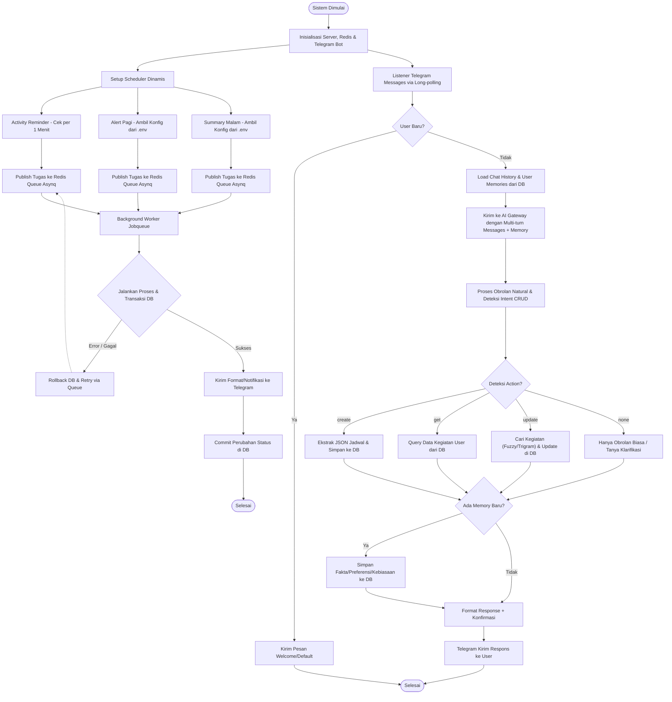
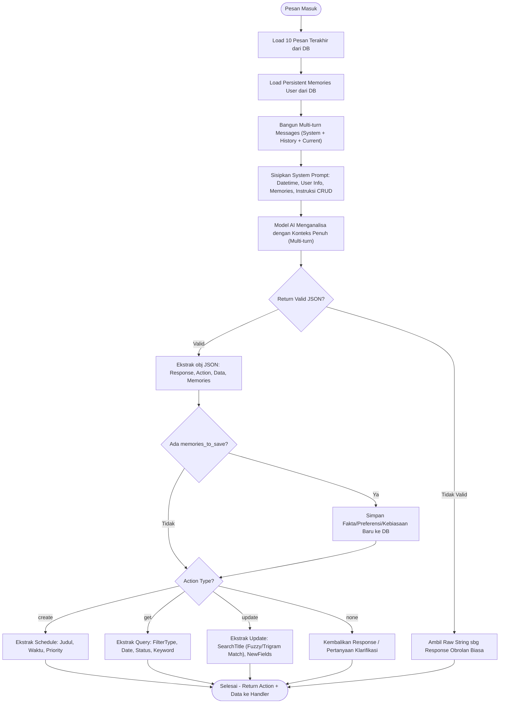
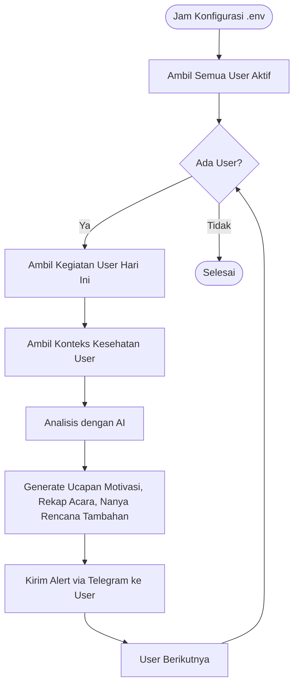
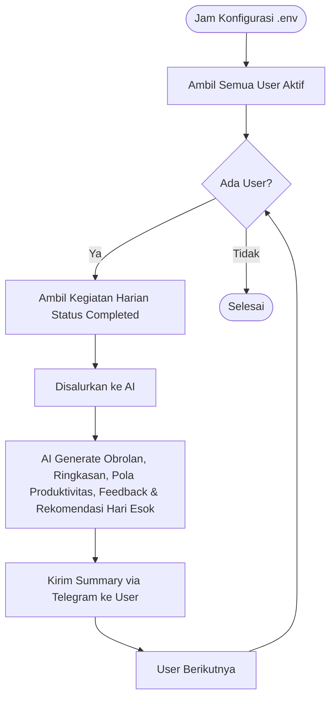
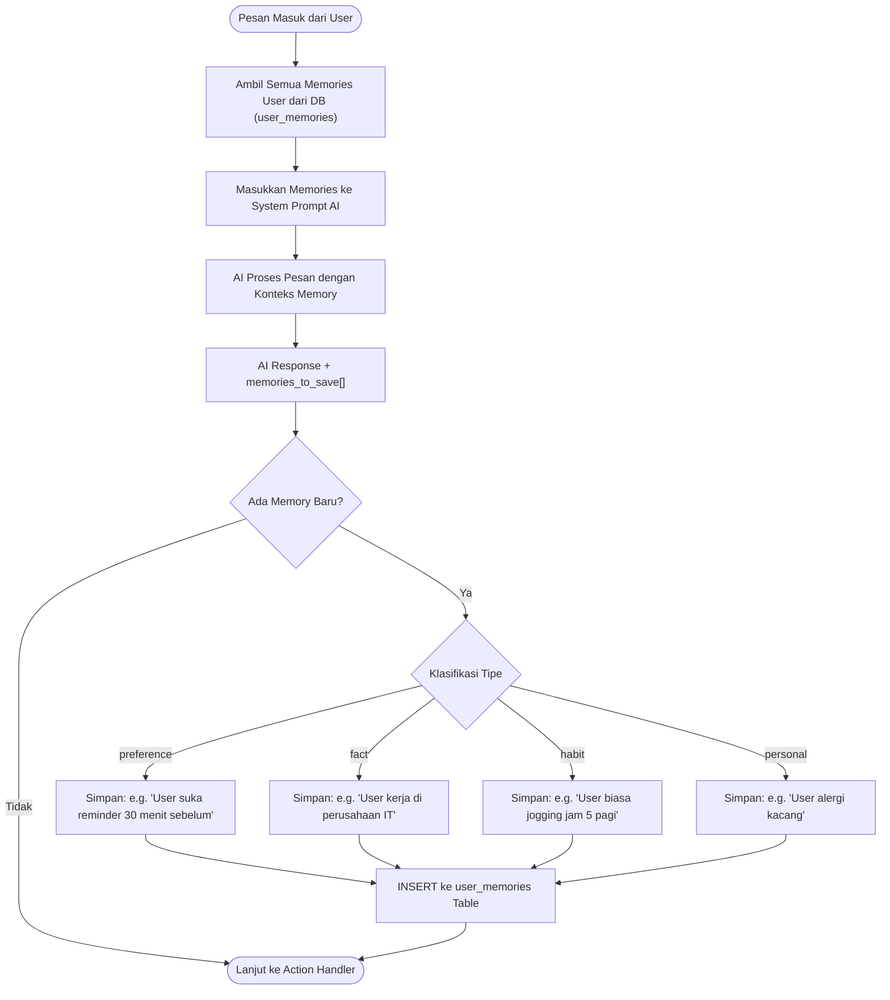
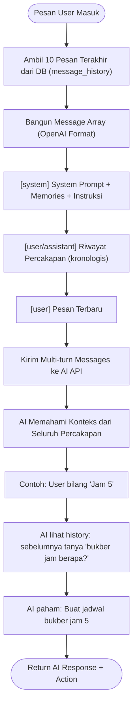

# Flowchart Smart Alert System

## 1. Flowchart Utama Sistem

```mermaid
flowchart TD
    Start([Sistem Dimulai]) --> Init[Inisialisasi Server, Redis & Telegram Bot]
    Init --> Scheduler[Setup Scheduler Dinamis]

    Scheduler --> RealtimeReminder[Activity Reminder - Cek per 1 Menit]
    Scheduler --> MorningAlert[Alert Pagi - Ambil Konfig dari .env]
    Scheduler --> EveningSummary[Summary Malam - Ambil Konfig dari .env]

    RealtimeReminder --> PushQueue1[Publish Tugas ke Redis Queue Asynq]
    MorningAlert --> PushQueue2[Publish Tugas ke Redis Queue Asynq]
    EveningSummary --> PushQueue3[Publish Tugas ke Redis Queue Asynq]

    PushQueue1 --> AsynqWorker[Background Worker Jobqueue]
    PushQueue2 --> AsynqWorker
    PushQueue3 --> AsynqWorker

    AsynqWorker --> ProcessJobs{Jalankan Proses & Transaksi DB}

    ProcessJobs -->|Error / Gagal| RetryLogic[Rollback DB & Retry via Queue]
    ProcessJobs -->|Sukses| SendCronMsg[Kirim Format/Notifikasi ke Telegram]

    SendCronMsg --> CommitDB[Commit Perubahan Status di DB]
    CommitDB --> EndJob([Selesai])
    RetryLogic -.-> PushQueue1

    Init --> TelegramListener[Listener Telegram Messages via Long-polling]

    TelegramListener --> CheckUser{User Baru?}
    CheckUser -->|Ya| SendWelcome[Kirim Pesan Welcome/Default]
    CheckUser -->|Tidak| LoadContext[Load Chat History & User Memories dari DB]

    SendWelcome --> EndMsg([Selesai])

    LoadContext --> AIGateway[Kirim ke AI Gateway dengan Multi-turn Messages + Memory]
    AIGateway --> ProcessMsg[Proses Obrolan Natural & Deteksi Intent CRUD]
    ProcessMsg --> DetectAction{Deteksi Action?}

    DetectAction -->|create| CreateFlow[Ekstrak JSON Jadwal & Simpan ke DB]
    DetectAction -->|get| GetFlow[Query Data Kegiatan User dari DB]
    DetectAction -->|update| UpdateFlow["Cari Kegiatan (Fuzzy/Trigram) & Update di DB"]
    DetectAction -->|none| ChatOnly[Hanya Obrolan Biasa / Tanya Klarifikasi]

    CreateFlow --> SaveMemories{Ada Memory Baru?}
    GetFlow --> SaveMemories
    UpdateFlow --> SaveMemories
    ChatOnly --> SaveMemories

    SaveMemories -->|Ya| PersistMemory[Simpan Fakta/Preferensi/Kebiasaan ke DB]
    SaveMemories -->|Tidak| FormatResponse[Format Response + Konfirmasi]
    PersistMemory --> FormatResponse

    FormatResponse --> SendAIResponse[Telegram Kirim Respons ke User]
    SendAIResponse --> EndMsg
```

## 2. Flowchart Proses Gateway AI (CRUD + Memory + Multi-turn)

```mermaid
flowchart TD
    Start([Pesan Masuk]) --> LoadHistory[Load 10 Pesan Terakhir dari DB]
    LoadHistory --> LoadMemories[Load Persistent Memories User dari DB]
    LoadMemories --> BuildMessages["Bangun Multi-turn Messages (System + History + Current)"]

    BuildMessages --> InsertSystemPrompt["Sisipkan System Prompt: Datetime, User Info, Memories, Instruksi CRUD"]
    InsertSystemPrompt --> AIProcessing["Model AI Menganalisa dengan Konteks Penuh (Multi-turn)"]

    AIProcessing --> OutputFormat{Return Valid JSON?}

    OutputFormat -->|Tidak Valid| FallbackResponse[Ambil Raw String sbg Response Obrolan Biasa]
    OutputFormat -->|Valid| Extract[Ekstrak obj JSON: Response, Action, Data, Memories]

    Extract --> CheckMemories{Ada memories_to_save?}
    CheckMemories -->|Ya| SaveNewMemories[Simpan Fakta/Preferensi/Kebiasaan Baru ke DB]
    CheckMemories -->|Tidak| CheckAction{Action Type?}
    SaveNewMemories --> CheckAction

    CheckAction -->|create| ExtractScheduleData[Ekstrak Schedule: Judul, Waktu, Priority]
    CheckAction -->|get| ExtractQueryData[Ekstrak Query: FilterType, Date, Status, Keyword]
    CheckAction -->|update| ExtractUpdateData["Ekstrak Update: SearchTitle (Fuzzy/Trigram Match), NewFields"]
    CheckAction -->|none| OnlyResponse["Kembalikan Response / Pertanyaan Klarifikasi"]

    ExtractScheduleData --> End([Selesai - Return Action + Data ke Handler])
    ExtractQueryData --> End
    ExtractUpdateData --> End
    OnlyResponse --> End
    FallbackResponse --> End
```

## 3. Flowchart Scheduler Alert Pagi

```mermaid
flowchart TD
    Start([Jam Konfigurasi .env]) --> GetAllUsers[Ambil Semua User Aktif]
    GetAllUsers --> LoopUser{Ada User?}

    LoopUser -->|Ya| GetUserActivities[Ambil Kegiatan User Hari Ini]
    LoopUser -->|Tidak| End([Selesai])

    GetUserActivities --> GetHealthContext[Ambil Konteks Kesehatan User]

    GetHealthContext --> AnalyzeWithAI[Analisis dengan AI]
    AnalyzeWithAI --> GenerateAlert[Generate Ucapan Motivasi, Rekap Acara, Nanya Rencana Tambahan]

    GenerateAlert --> SendAlert[Kirim Alert via Telegram ke User]

    SendAlert --> NextUser[User Berikutnya]
    NextUser --> LoopUser
```

## 4. Flowchart Scheduler Summary Malam

```mermaid
flowchart TD
    Start([Jam Konfigurasi .env]) --> GetAllUsers[Ambil Semua User Aktif]
    GetAllUsers --> LoopUser{Ada User?}

    LoopUser -->|Ya| GetTodayActivities[Ambil Kegiatan Harian Status Completed]
    LoopUser -->|Tidak| End([Selesai])

    GetTodayActivities --> AIAnalysis[Disalurkan ke AI]
    AIAnalysis --> GenerateInsights[AI Generate Obrolan, Ringkasan, Pola Produktivitas, Feedback & Rekomendasi Hari Esok]

    GenerateInsights --> SendSummary[Kirim Summary via Telegram ke User]

    SendSummary --> NextUser[User Berikutnya]
    NextUser --> LoopUser
```

## 5. Flowchart Pengingat Real-Time (Per-Menit)

```mermaid
flowchart TD
    Start([Cron: Setiap Menit]) --> GetPending[Ambil Aktivitas Status 'Pending' dg Time <= Now()]
    GetPending --> LoopActivity{Ada Kegiatan Expired?}

    LoopActivity -->|Tidak| End([Selesai])
    LoopActivity -->|Ya| CheckReminded{Sudah Diremind?}

    CheckReminded -->|Ya| NextActivity
    CheckReminded -->|Tidak| GetUserDetail[Ambil Profil User Terkait]

    GetUserDetail --> FormatMsg[Format Notifikasi: Pengingat, Judul, Waktu, Catatan]
    FormatMsg --> SendTelegram[Kirim Notifikasi via Telegram]

    SendTelegram --> UpdateStatus[Update Kolom `ReminderTime`]
    UpdateStatus --> NextActivity[Kegiatan Berikutnya]

    NextActivity --> LoopActivity
```

## 7. Flowchart Persistent Memory (OpenClaw-style)

```mermaid
flowchart TD
    Start([Pesan Masuk dari User]) --> FetchMemories["Ambil Semua Memories User dari DB (user_memories)"]
    FetchMemories --> InjectToPrompt["Masukkan Memories ke System Prompt AI"]

    InjectToPrompt --> AIProcess["AI Proses Pesan dengan Konteks Memory"]
    AIProcess --> AIResponse["AI Response + memories_to_save[]"]

    AIResponse --> HasNewMemory{Ada Memory Baru?}
    HasNewMemory -->|Tidak| Done([Lanjut ke Action Handler])
    HasNewMemory -->|Ya| ClassifyMemory{Klasifikasi Tipe}

    ClassifyMemory -->|preference| SavePref["Simpan: e.g. 'User suka reminder 30 menit sebelum'"]
    ClassifyMemory -->|fact| SaveFact["Simpan: e.g. 'User kerja di perusahaan IT'"]
    ClassifyMemory -->|habit| SaveHabit["Simpan: e.g. 'User biasa jogging jam 5 pagi'"]
    ClassifyMemory -->|personal| SavePersonal["Simpan: e.g. 'User alergi kacang'"]

    SavePref --> InsertDB["INSERT ke user_memories Table"]
    SaveFact --> InsertDB
    SaveHabit --> InsertDB
    SavePersonal --> InsertDB

    InsertDB --> Done
```

## 8. Flowchart Multi-turn Conversation

```mermaid
flowchart TD
    Start([Pesan User Masuk]) --> FetchHistory["Ambil 10 Pesan Terakhir dari DB (message_history)"]
    FetchHistory --> BuildArray["Bangun Message Array (OpenAI Format)"]

    BuildArray --> SystemMsg["[system] System Prompt + Memories + Instruksi"]
    SystemMsg --> HistoryMsgs["[user/assistant] Riwayat Percakapan (kronologis)"]
    HistoryMsgs --> CurrentMsg["[user] Pesan Terbaru"]

    CurrentMsg --> SendToAI["Kirim Multi-turn Messages ke AI API"]
    SendToAI --> AIUnderstands["AI Memahami Konteks dari Seluruh Percakapan"]

    AIUnderstands --> Example1["Contoh: User bilang 'Jam 5'"]
    Example1 --> WithContext["AI lihat history: sebelumnya tanya 'bukber jam berapa?'"]
    WithContext --> Result["AI paham: Buat jadwal bukber jam 5"]

    Result --> Done([Return AI Response + Action])
```
