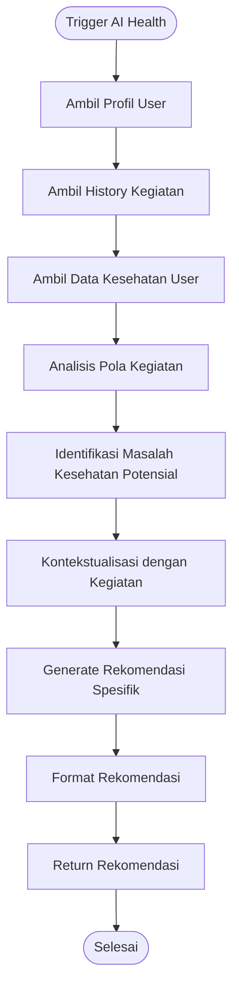

# Flowchart Smart Alert System

## 1. Flowchart Utama Sistem

## 2. Flowchart Proses AI untuk Parsing Pesan

## 3. Flowchart Scheduler Alert Pagi

## 4. Flowchart Scheduler Summary Malam

## 5. Flowchart Proses Input Kegiatan User

## 6. Flowchart Sistem AI untuk Rekomendasi Kesehatan

